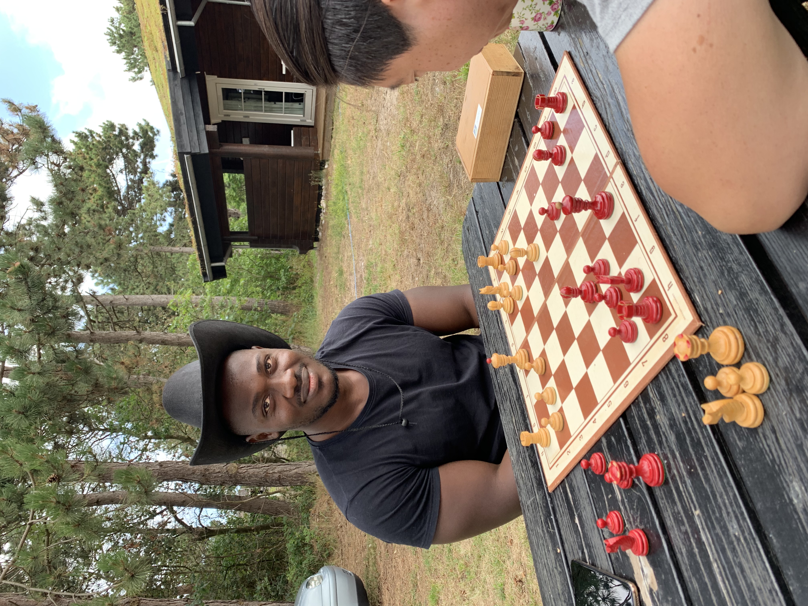

### Hello 👋🏿 I'm Alex.

### Cloud automation (DevOps) Engineer

I am specialising in Microsoft Technologies with main focus on Azure, C# and Python. That said, I have worked with AWS for a year and still open to work on any project on AWS.

I like to work with IaC using Terraform mainly, Configuration management using Ansible. When it comes to containers, Docker hub or ACR and Azure kubernetes Services are my go to. For CI/CD, Azure DevOps is my alpha, Jenkins my omega and GitHub Actions my beta 😄

Aside work and the cloud, I have other interests as u will soon find out below👇🏿
- 🔭 I’m currently working on a new cross platform mobile app using Xamarin framework with C#  in my spare time.
- 🌱 So out of curiousity I decided to try out Apple's new SwiftUI framework and ended up publishing my 1st iOS App to the App Store 😀
- 👯 I’m looking to collaborate on interesting python projects
- 📫 How to reach me: [Connect on LinkedIn](https://www.linkedin.com/in/alex-gameli-heyman-1a556070/)
- ⚡ Fun fact: I used to DJ in my university's Friday bar 😀
